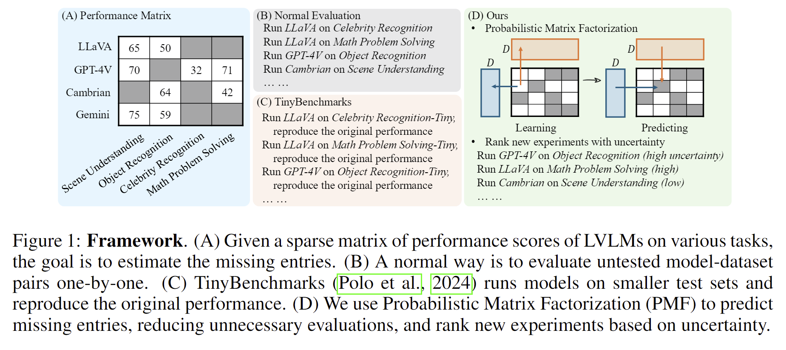

# **Can We Predict Performance of Large Models across Vision-Language Tasks?**

This repository contains the source code for the paper.

**Can We Predict Performance of Large Models across Vision-Language Tasks?** [[ArXiv]()]

Qinyu Zhao $^1$, Ming Xu $^1$, Kartik Gupta $^2$, Akshay Asthana $^2$, Liang Zheng $^1$, Stephen Gould $^1$

$^1$ Australian National University

\{qinyu.zhao, mingda.xu, liang.zheng, stephen.gould\}@anu.edu.au

$^2$ Seeing Machines Ltd

\{kartik.gupta, akshay.asthana\}@seeingmachines.com




## Abstract of Our Paper
Evaluating large vision-language models (LVLMs) is very expensive, due to the high computational costs and the wide variety of tasks. The good news is that if we already have some observed scores, we may be able to infer unknown ones. In this study, we propose a new framework for predicting unknown performance scores based on observed ones from other LVLMs or tasks. We first formulate the performance prediction as a matrix completion task. Specifically, we construct a sparse performance matrix $\boldsymbol{R}$, where each entry $R_{mn}$ represents the performance score of the $m$-th model on the $n$-th dataset. By applying probabilistic matrix factorization (PMF) with Markov chain Monte Carlo (MCMC), we can complete the performance matrix, that is, predict unknown scores. Additionally, we estimate the uncertainty of performance prediction based on MCMC. Practitioners can evaluate their models on untested tasks with higher uncertainty first, quickly reducing errors in performance prediction. We further introduce several improvements to enhance PMF for scenarios with sparse observed performance scores. In experiments, we systematically evaluate 108 LVLMs on 176 datasets from 36 benchmarks, constructing training and testing sets for validating our framework. Our experiments demonstrate the accuracy of PMF in predicting unknown scores, the reliability of uncertainty estimates in ordering evaluations, and the effectiveness of our enhancements for handling sparse data.

## Getting Started

### Installation
####  Clone this repository to your local machine.

```
git clone https://github.com/Qinyu-Allen-Zhao/CrossPred-LVLM.git
```

#### Install the environment
We strongly recommend you to use two environments because of the package conflicts, one for LVLM evaluation and the other for PMF modeling (performance prediction).

```
# LVLM Evaluation
conda env create -f environment_lvlm_eval.yaml
conda activate lvlm_eval
```

** It is very tricky to run many LVLMs in one environment. We try to provide a general environment covering as more LVLMs as we can. If you find issues when running a model, a common solution is to change the version of the ```transformers``` package.

```
# Performance Prediction
conda env create -f environment_pymc.yaml
conda activate pymc_env
```
** While there are newer PYMC packages, we found issues when running those packages for Bayesian PMF. After strugging, giving up, new hope and new giving up, we found this environment works.

### Usage
Our experiments are mainly consisted of the following three stages.


#### 1. Evaluate LVLMs on various benchmarks
We evaluate LVLMs by running the `evaluate_lvlm.py` file. You can find all available LVLMs and benchmarks in `utils/config.py`.

We provide all experiment scripts in ```scripts/new_experiments.sh``` for open-sourced LVLMs and ```scripts/gpt_experiments.sh``` for GPT and Gemini. You can run
```
CUDA_VISIBLE_DEVICES=0,1,2,3 bash ./scripts/new_experiments.sh
```

Usually, a GPU with 24GB memory should be enough for running 7B models. Larger models are more memory-hungry : (

#### Arguments Explanation for  `evaluate_lvlm.py` 

- **`--model_name`**  
   - *Default:* `"LLaVA-13B"`  
   - Specifies the name of the model to be evaluated.

- **`--model_path`**  
   - *Default:* `"liuhaotian/llava-v1.5-13b"`  
   - Specifies the path or name of the model checkpoint.

- **`--num_samples`**  
   - *Type:* `int`  
   - An optional argument to set the number of samples to process. If you set the number of samples, the dataset will be subsampled. 
   - *Default:* `None` (processes all available samples if not provided).

- **`--dataset`**  
   - *Default:* `"SEED_2"`  
   - Specifies the dataset used for evaluation.

- **`--store_path`**  
   - *Type:* `str`  
   - Specifies the directory where the model's outputs will be saved.  
   - *Default:* `"./output/LLaVA-13B/SEED_2/"`

- **`--num_chunks`**  
   - *Type:* `int`  
   - Sets the number of chunks into which the dataset will be split for processing. Used for multiple-gpu settings.
   - *Default:* `1`

- **`--chunk_idx`**  
   - *Type:* `int`  
   - Specifies which chunk to process (useful for parallel processing). Used for multiple-gpu settings.  
   - *Default:* `0`

- **`--temperature`**  
   - *Type:* `float`  
   - Defines the sampling temperature, which controls the randomness in predictions.  
   - *Default:* `0.0`

- **`--only_ans`**  
   - *Type:* `boolean`  
   - A flag (`store_true`). If provided, only the final answers will be returned. Otherwise, the logits and hidden states will be stored, which may lead to large memory usage.

- **`--num_beams`**  
   - *Type:* `int`  
   - Controls the number of beams for beam search (a technique for generating multiple candidate outputs).  
   - *Default:* `1`


#### 2. Build PMF or PTF models
Please run ```run_pmf.py``` for training and validating PMF, and run ```run_ptf.py```for training and validating PTF.

We also provide the experiment scripts of our study in ```scripts/run_pmf.sh``` and ```scripts/run_ptf.sh```.

#### Argument Explanations for ```run_pmf.py```

- **`--random_seed`**  
   - *Type:* `int`  
   - Sets the random seed for reproducibility in the experiment. We find this is not enough to control the MCMC sampling. Tthe results with the same random seed are very close but not exactly the same.
   - *Default:* `81021` (Anniversary date with my wife)

- **`--dim`**  
   - *Type:* `int`  
   - Defines latent dimension used in the model.  
   - *Default:* `10`

- **`--alpha`**  
   - *Type:* `float`  
   - Specifies the precision parameter.
   - *Default:* `2`

- **`--std`**  
   - *Type:* `float`  
   - Sets the standard deviation.
   - *Default:* `0.05`

- **`--draws`**  
   - *Type:* `int`  
   - Specifies the number of MCMC draws for the sampling process.  
   - *Default:* `100`

- **`--subset`**  
   - *Type:* `str`  
   - Indicates a subset of metrics to be used during evaluation.  
   - *Default:* `"None"`

- **`--percent_test`**  
   - *Type:* `float`  
   - Specifies the percentage of the dataset to be reserved for testing.  
   - *Default:* `20` (%)


#### 3. Additional Experiments
We conduct additional interesting experiments in our study, including

- **Active Evaluation**
    - Main Code: `cold_start.py`
    - Script: `scripts/cold_start.sh`

- **Model Each Metric Separately**
    - Main Code: `separate_modeling.py`
    - Script: `scripts/separate_modeling.sh`

- **Use Different Dataset Profiles**
    - Main Code: `run_ptf.py`
    - Script: `scripts/dataset_profile.sh`

- **Which models and benchmarks are informative to PMF?**
    - Main Code: `informative.py`
    - Script: `scripts/informative.sh`

- **Use different latent dimension**
    - Main Code: `run_pmf.py`
    - Script: `scripts/different_D.sh`


## Reproduction
For easier reproduction of our results, we provide files in each stage.

| File Path | Remark |
| -----| ---- |
| Stage 1 | |
| data/result_summary.json | The performance scores of 108 LVLMs on 176 datasets. Each dataset has one main metric, either accuracy or BARTScore. |
| data/all_result_summary.json | The performance scores of 108 LVLMs on 176 datasets with six metrics. Uncalculated scores are omitted. For example, on a open-ended question task, there is no accuracy calcualted. |
| Stage 2 | |
| data/model_profiles.json | Model profiles for Constrained PMF or Constrained PTF. |
| data/dataset_profiles.json | Dataset profiles for Constrained PMF or Constrained PTF. |
| Stage 3 | |
| logs/*.log | Logs of our experiments for our paper. Open it just as text files. We find that, even when we fix the random seed, there is still a slight difference for PMF or PTF. That's probably caused by the sampling process of MCMC. In our experiments, we run each experiment 10 times and get the average performance of PMF or PTF. The results are stable. |

## Citation

If you use our codebase or our results in your research, please cite our work:

```bibtex
@article{zhao2024crosspred,
  title={Can We Predict Performance of Large Models across Vision-Language Tasks?},
  author={Zhao, Qinyu and Xu, Ming and Gupta, Kartik and Asthana, Akshay and Zheng, Liang and Gould, Stephen},
  journal={arXiv preprint},
  year={2024}
}
```

## Acknowledgments

We would like to thank the following prior works, on which we build our study.

#### VLMEvalKit [Report](https://www.arxiv.org/abs/2407.11691), [Code](https://github.com/open-compass/VLMEvalKit/tree/main)

#### LMMs-Eval [Report](https://arxiv.org/abs/2407.12772), [Code](https://github.com/EvolvingLMMs-Lab/lmms-eval/tree/main)

#### HEMM [Report](https://arxiv.org/abs/2407.03418), [Code](https://github.com/pliang279/HEMM/tree/main)

#### Prismatic VLMs [Report](https://arxiv.org/abs/2402.07865), [Code](https://github.com/TRI-ML/prismatic-vlms)

#### Extra Prismatic VLMs [Report](https://www.arxiv.org/abs/2407.15211), [Code](https://github.com/RylanSchaeffer/AstraFellowship-When-Do-VLM-Image-Jailbreaks-Transfer)

#### PYMC [Documentation](https://www.pymc.io/welcome.html)

and we also would like to thank the authors of all benchmarks and models we covered in our study. 